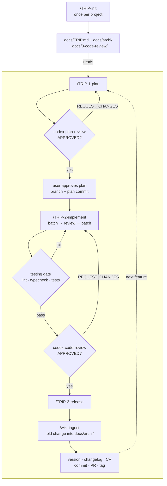

# hjarenas-agentic-skills

A Claude Code plugin marketplace: the TRIP development workflow, project memory as a Karpathy-style
LLM wiki, prompt-driven Codex delegation, and a curated subset of Matt Pocock's engineering skills.

TRIP is adapted from [PiLastDigit/TRIP-workflow](https://github.com/PiLastDigit/TRIP-workflow) —
see [`INSPIRATIONS.md`](INSPIRATIONS.md) for what was taken from where, and what was changed.

## Install

```bash
/plugin marketplace add hjarenas/agentic-skills
/plugin install trip@hjarenas-agentic-skills
```

Installing `trip` pulls in `trip-wiki` automatically (declared dependency). The others are
independent:

```bash
/plugin install pocock-core@hjarenas-agentic-skills
/plugin install toolbox@hjarenas-agentic-skills

# codex-bridge depends on OpenAI's own Codex plugin, which lives in a separate marketplace.
# Claude Code will not auto-install a plugin from a marketplace you haven't added, so this
# is a required manual step before codex-bridge's skills (codex-plan-review, etc.) register —
# see "Codex integration" below for why it stays a separate plugin.
/plugin marketplace add openai/codex-plugin-cc
/plugin install codex@openai-codex
/reload-plugins   # newly installed plugins' commands aren't registered until reloaded
/codex:setup
/plugin install codex-bridge@hjarenas-agentic-skills
/reload-plugins
```

For local development, add the working copy directly:

```bash
claude plugin marketplace add /path/to/agentic-skills
```

## Optional: rtk for token efficiency

TRIP and `codex-bridge` shell out constantly — git, `scripts/*.py`, `codex-companion.mjs` — so a
token-savings proxy pays off here more than in a typical repo.
[`rtk`](https://www.rtk-ai.app/) filters that bash output before it reaches the model's context:

```bash
brew install rtk
```

Once installed, a Claude Code hook transparently rewrites eligible commands (`git status` → `rtk
git status`) — no prompt or plugin changes needed. This is a machine-level setup, not a plugin
dependency: none of these plugins require it, and it isn't declared in any `plugin.json`.

## Plugins

| Plugin | Skills | What it does |
| :--- | :--- | :--- |
| **trip** | `TRIP-init` `TRIP-1-plan` `TRIP-2-implement` `TRIP-3-release` `TRIP-review` `TRIP-test` `TRIP-research` `TRIP-hotfix` `TRIP-auto` `TRIP-upgrade` `TRIP-compact` | Plan → Implement → Review → Test, with versioned docs, changelog and release ceremony |
| **trip-wiki** | `wiki-init` `wiki-migrate` `wiki-ingest` `wiki-query` `wiki-lint` | Architecture memory as atomic linked pages under `docs/archi/` |
| **codex-bridge** | `codex-plan-review` `codex-code-review` `codex-implement` `codex-ask` | TRIP's own Codex prompts, run through the OpenAI Codex plugin's runtime |
| **pocock-core** | `grill-with-docs` `to-spec` `to-tickets` `triage` `teach` `writing-great-skills` `research` `wayfinder` (+3 deps) | Vendored from [mattpocock/skills](https://github.com/mattpocock/skills) |
| **toolbox** | `commit` `AskUserQuestion` + 4 short commands | Standalone helpers; `commit` enforces Conventional Commits and bans AI attribution trailers |

The TRIP skills stop and ask at their decision points via the **native** `AskUserQuestion` tool,
so nothing extra is needed on Claude Code. `toolbox`'s `AskUserQuestion` skill is a shim for
agents that lack that tool (Codex CLI, OpenCode, Mistral Vibe), where the instruction would
otherwise be silently ignored and the skill would run straight past a question it was meant to
stop on. `trip` does not depend on it.

---

## The TRIP workflow



**Walking one feature through:**

1. **`/TRIP-1-plan "add rate limiting"`** — reads `docs/TRIP.md` for the project profile, then
   `docs/archi/index.md` and the two or three pages the feature touches (not the whole wiki).
   Asks clarifying questions, writes `docs/1-plans/F_0.5.0_rate-limiting.plan.md`, then loops
   `codex-plan-review` until `APPROVED`. Creates the branch and commits the plan.

2. **`/TRIP-2-implement <plan>`** — splits the plan into batches that each leave the tree green,
   delegates each to `codex-implement`, and reviews the delta itself between batches, fixing
   problems directly and carrying the corrections forward as notes. Then the **testing gate**
   (lint, typecheck, affected tests, author missing tests), then the `codex-code-review` loop
   until `APPROVED`. `/codex:adversarial-review` is available as an extra pass on risky changes.

3. **`/TRIP-3-release <plan>`** — version bump, promotes the Codex review to
   `docs/3-code-review/CR_wa_vx.y.z.md`, changelog file and table, then **`/wiki-ingest`** to fold
   the change into `docs/archi/` and write `log/v0.5.0.md`. Commits, opens the PR, tags after merge.

**Off the main line:** `/TRIP-research` (investigate, with `codex-ask` to red-team the conclusion),
`/TRIP-hotfix` (skip the ceremony for urgent fixes), `/TRIP-review` (audit a past version),
`/TRIP-test` (testing pass), `/TRIP-auto` (run the whole chain unattended),
`/wiki-query` (ask the architecture a question), `/wiki-lint` (periodic wiki health).

**Coming from Pocock's front end:** `/grill-with-docs` or `/wayfinder` before `/TRIP-1-plan` when
the shape of the work isn't settled yet — TRIP is strong from an agreed plan onward, and thin
before it.

---

## Project memory: the LLM wiki

TRIP used to keep architecture in one `docs/ARCHI.md`, with a `TRIP-compact` skill to shrink it
when it grew too big. Compaction buys size by deleting detail, permanently — and every branch
edits the same file, so every merge conflicts.

`trip-wiki` implements [Andrej Karpathy's LLM Wiki pattern](https://gist.github.com/karpathy/442a6bf555914893e9891c11519de94f)
against the repo's own docs:

```
docs/archi/
├── index.md        # the catalog — one line per page; the only file read in full
├── SCHEMA.md       # this project's conventions
├── pages/          # atomic topic pages, [[wikilink]]ed, citing file:line
└── log/v0.4.2.md   # one log file per release
```

Pages get **split**, never compacted, so nothing is lost. Readers follow the index to the two or
three pages they need. `/wiki-ingest` runs from `TRIP-3-release` on every version; `/wiki-lint`
checks health; `/wiki-query` answers questions with citations.

**Branch and worktree safety** was the design constraint, since the wiki lives in the repo:

- The log is **one file per release**, never one appended file — an append-only log conflicts on
  every merge.
- `index.md` is **one line per page, sorted by slug**, so two branches adding pages merge without
  help.
- Pages are atomic, so branches touching different subsystems touch different files.

### Obsidian

`docs/archi/` is a valid Obsidian vault as written — point Obsidian at the folder and it opens.
The compatibility is free: `[[slug]]` links and YAML frontmatter were chosen because they survive
file moves and are greppable, and being Obsidian's native formats is a side effect. Nothing in the
wiki depends on Obsidian, and the agent never uses it.

Opening it buys a **human** three things the agent doesn't need:

- **Graph view** — the shape of the architecture at a glance. Orphans and over-connected
  god-pages are visible before lint would name them.
- **Backlinks** — "what depends on this?" answered by the wiki instead of by grep.
- **Search and canvas** — fuzzy search across pages, and canvas boards for sketching a change
  over the pages that already exist.

`wiki_lint.py` reads `links: [a, b]`, `links: ["[[a]]"]` and Obsidian's block-sequence form
identically, so editing a page in Obsidian's property editor won't invent drift findings. If you
do open it, decide about `docs/archi/.obsidian/` — gitignore it, or commit it to share view
settings — rather than letting it drift in as noise.

### Why not claude-obsidian or obsidian-second-brain?

Both are excellent for a *personal* second brain, but neither fits project docs: they want the
vault **outside** the repo, have no branch or worktree awareness, and
[claude-obsidian](https://github.com/AgriciDaniel/claude-obsidian) holds a process-lifetime
vault-wide lock that two agents in two worktrees would serialize on. Install one of them
alongside if you want a personal vault; `trip-wiki` is for the code's own memory.

---

## Codex integration

`codex-bridge` depends on OpenAI's own Codex plugin, from a separate marketplace — see the
Install section above for the required commands (`/plugin marketplace add openai/codex-plugin-cc`
before `/plugin install codex@openai-codex`; Claude Code will not auto-install a plugin from a
marketplace you have not added).

### Why these skills still exist alongside `/codex:review`

`/codex:review` and `/codex:adversarial-review` are good and worth running — but they ship
OpenAI's prompts and are **git-diff scoped**. TRIP needs things they do not provide:

| | `/codex:*` | `codex-bridge` |
| :--- | :--- | :--- |
| Review a markdown **plan** | not possible — diff-scoped only | `codex-plan-review` |
| Grounded in `docs/archi/` + the project's `checklist.md` | no | yes |
| Suppresses TRIP's false-positive classes | no | yes |
| Verdicts | `approve` / `needs-attention` | `APPROVED` / `REQUEST_CHANGES` / `NEEDS_REWORK` |

What did get deleted: five bash scripts, a `jq` dependency, and per-target thread bookkeeping.
`scripts/codex-run.py` renders the prompt templates and hands them to the Codex plugin's runtime
via `codex-companion.mjs task --prompt-file`.

**Reviews are stateless by design.** The runtime can only resume a workspace's *last* thread,
which would collide with TRIP-2's implement → review → implement alternation. So every review turn
is a fresh run, and the loop state travels in the prompt: the previous review is stored under
`.codex-bridge/` (gitignored) and spliced back in. This makes the implementer notes load-bearing —
they are the only signal distinguishing "I fixed it" from "I disagree, and here's why". Only
`codex-implement` uses `--resume-last`, where continuing the batch is the point.

Use `/codex:adversarial-review` as an extra pass on risky changes: it attacks the design, which
neither review loop does.

---

## Vendored skills

`plugins/pocock-core/` holds copies of eleven skills from
[mattpocock/skills](https://github.com/mattpocock/skills) (MIT) — the eight requested plus three
they depend on (`grilling`, `domain-modeling`, `setup-matt-pocock-skills`). They are **copies you
can edit**, which is the point: they can be wired into TRIP.

`UPSTREAM.json` pins the commit they came from, which gives a merge base:

```bash
scripts/vendor-sync.py --check     # what moved upstream since the pin
scripts/vendor-sync.py             # 3-way merge it in, keeping local edits
scripts/vendor-sync.py --ref v2.0  # a specific upstream ref
```

Files you never touched fast-forward. Files you edited merge, and only genuinely overlapping edits
produce conflict markers labelled `ours` / `upstream (sha)`. The pin only advances on a clean run,
so a conflicted merge leaves the base valid for a retry.

Run `/setup-matt-pocock-skills` once per repo before using `to-spec`, `to-tickets`, `triage` or
`wayfinder` — they need its issue-tracker and triage-label configuration.

If you would rather subscribe than fork, uninstall `pocock-core` and run
`/plugin install mattpocock-skills` for the full, always-current set. Do not run both — you would
get every skill twice.

---

## Per-project configuration

TRIP skills are installed **read-only**, so nothing is customized in place. `/TRIP-init` writes
everything project-specific into the project itself:

| File | Holds |
| :--- | :--- |
| `docs/TRIP.md` | The profile: name, type, main branch, version file, week anchor, lint/typecheck/test commands, plan considerations, guidance sections, test priorities, tutorial preferences |
| `docs/3-code-review/checklist.md` | Review criteria, tailored to the codebase |
| `docs/3-code-review/cr-template.md` | Code-review output skeleton |
| `docs/archi/SCHEMA.md` | The wiki's conventions |

A plugin update therefore never touches your customizations.

**Coming from a pre-plugin TRIP setup** (customized `.claude/skills/TRIP-*` copies)? Run
`/TRIP-upgrade`: it extracts the customizations into `docs/TRIP.md`, installs the review files,
verifies nothing was lost, then removes the local copies in a separate commit. Follow with
`/wiki-migrate` to split `docs/ARCHI.md`.

## Layout

```
.claude-plugin/marketplace.json    # the marketplace catalog
plugins/<name>/
├── .claude-plugin/plugin.json
├── skills/<skill>/SKILL.md
├── scripts/                       # codex-bridge, trip-wiki
├── templates/                     # trip: files TRIP-init copies into projects
└── references/                    # trip-wiki: the wiki spec
scripts/vendor-sync.py             # upstream merge tool for pocock-core
```

## Credits

[`INSPIRATIONS.md`](INSPIRATIONS.md) records what this borrowed and from whom — PiLastDigit's TRIP
workflow, Karpathy's LLM Wiki, Matt Pocock's skills, OpenAI's Codex plugin, Anthropic's plugin
system — what was changed in each case and why, and what was considered and rejected.

## License

MIT. `plugins/pocock-core/` is derived from Matt Pocock's MIT-licensed work; see its `LICENSE`
and `NOTICE`.
